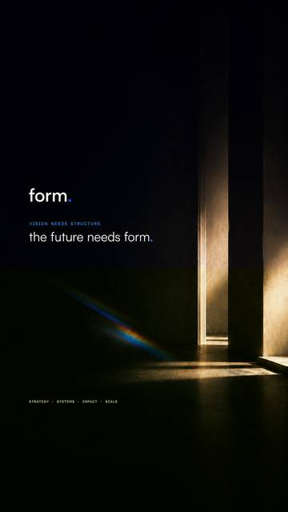

# Dontae Ladson

### Founder & Solutions Architect · Form Intel

**I build systems, products, brands, and experiences that help people move from vision to something real.**

Full-Stack Development · Web · AI · Automation · Creative · Marketing · Systems • Infrastructure

[form.](https://formintel.co) · [GitHub](https://github.com/donnieladd)

---

## A little about me

I came into technology through people, creativity, and systems.

I kept seeing good people with strong ideas fighting through bad tools, disconnected processes, unclear ownership, and experiences that did not match the vision. So I started building.

Sometimes that looks like software. Sometimes it is a website, brand system, campaign, workflow, AI agent, product, or operating model. The medium changes. The goal does not.

**Make the work clearer, stronger, and more human.**

> **I build around people, not people around systems.**

Relational equity matters to me. I care about whether the thing works, but I also care whether people trust it, understand it, and feel considered by it.

---

## What I’m building

**form. is the company I’m building for the long term.**

We work across strategy, systems, software, AI, digital, creative, marketing, and operations. I care about seeing the whole picture and building what actually needs to exist.

<table>
<tr>
<td width="50%" valign="top">

<h3 align="center">form. | HQ</h3>

This is the build I’m deepest in right now.

A hybrid human + AI workforce operating system where people and persistent AI employees can share work, context, tools, authority, memory, and accountability.

The goal is simple: make work clearer without making the organization less human.

</td>
<td width="50%" valign="top">

<h3 align="center">form. | leads</h3>

A lead generation system I’m building for form.digital.

It discovers businesses that may need a stronger website, researches and qualifies them with AI, scores the opportunity, syncs the lead into Monday.com, and supports outreach through Gmail.

</td>
</tr>
<tr>
<td width="50%" valign="top">

<h3 align="center">Allen</h3>

Allen is the agent I’m training and the intelligence platform I’m beginning to build.

It is early, but real. I’m teaching it to inspect software, use tools, gather evidence, diagnose problems, remember what happened, and get better over time.

The long-term direction is an LLM and intelligence platform, not just another assistant wrapper.

</td>
<td width="50%" valign="top">

<h3 align="center">form.digital</h3>

Web and full-stack development are a major part of my work through form.digital.

I build websites, full-stack applications, digital platforms, APIs, integrations, design systems, and production-ready experiences where strategy, story, design, engineering, and performance all have to work together.

</td>
</tr>
</table>

---

## Creative & Marketing

### form.creative & marketing

**We create worlds. Not just the content inside them.**

I lead our creative and marketing agency across brand identity, creative direction, campaigns, content, design, video, social, digital experiences, and marketing strategy.

To me, creative work is not decoration. It is how people experience an organization. The brand, the product, the website, the campaign, and the human interaction should all feel like they came from the same place.

---

## How I think about the work

**People · Creativity · Process · Data · Software · Intelligence**

I move across disciplines because real problems usually do too. I may be thinking about architecture, code, customer experience, brand, workflow, data, or leadership in the same build.

The questions I keep coming back to are simple:

- Does this make the work easier to understand?
- Does it help people do better work?
- Is ownership clear?
- Can people trust it?
- Does the technology serve the relationship, or get in the way of it?

---

## Languages

**Currently digging into:** `C++`

### Frameworks & Application Development

`Next.js` · `React` · `Node.js` · `FastAPI` · `LangGraph` · `Tailwind CSS` · `Framer Motion`

### Data, Infrastructure & Deployment

---

## AI & Intelligence

I do not build around one model company. Different models are useful for different kinds of work.

**Models & ecosystems**

`OpenAI` · `Anthropic / Claude` · `Google Gemini` · `xAI / Grok` · `Moonshot AI / Kimi` · `DeepSeek` · `Z.ai / GLM` · `Nous Research / Hermes`

**Agentic systems & runtime tooling**

`OpenClaw` · `Hermes Agent` · `LangGraph` · `MCP` · `OpenRouter` · `Tool Use` · `Agent Orchestration` · `Model Routing` · `RAG` · `Memory Systems` · `Context Engineering`

What interests me most is not which model wins a benchmark. It is what happens when intelligence has the right context, tools, memory, boundaries, feedback, and relationship with the people using it.

---

## VISION NEEDS STRUCTURE

### the future needs form.

